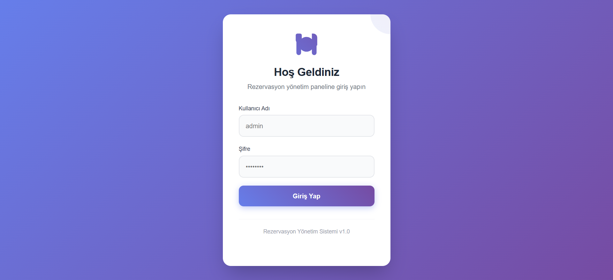
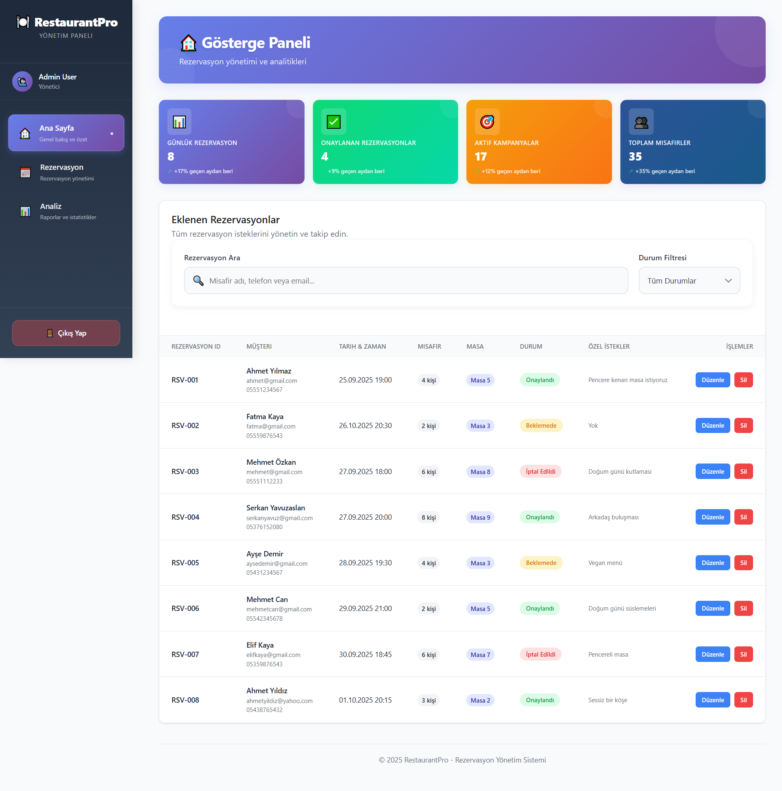
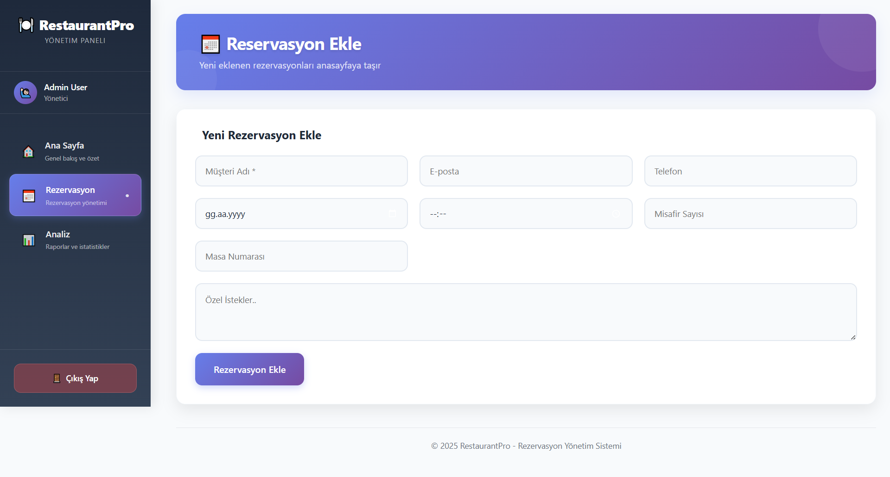
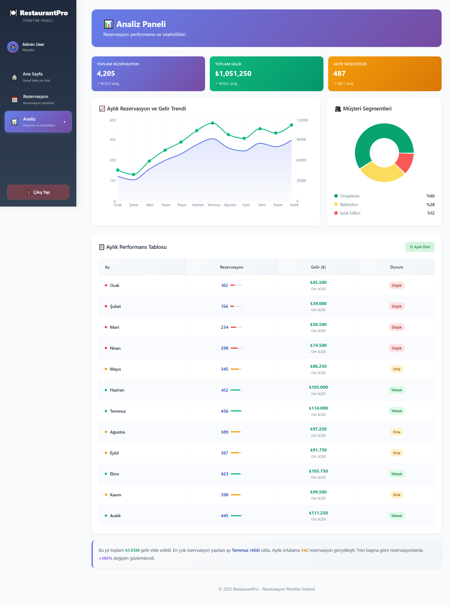

# React + Vite

# 🛎️ Restoran Rezervasyon Admin Paneli

Bu proje, restoran rezervasyon süreçlerini yönetmek için geliştirilmiş bir **React + Vite tabanlı admin panel uygulamasıdır**.  
Yönetici, rezervasyonları görüntüleyebilir, ekleyebilir, düzenleyebilir ve analiz edebilir.  

---

## 🚀 Özellikler
- 📅 Rezervasyon Ekle / Düzenle / Sil  
- 👥 Müşteri Yönetimi  
- 📊 Performans ve İstatistik Kartları  
- 📈 Grafikler ile Görsel Analiz (Recharts)  
- 🎨 Modern ve responsive arayüz  

1.Recharts kullandım. Grafik ve tabloyu bu kütüphane ile oluşturarak daha gerçekçi bir görünüm elde ettim.

2.components klasörü altında analytics, dashboard, reservations, ui gibi alt klasörler oluşturarak bileşenleri ayırdım. pages klasöründe ilgili dosyaları açıp JSX dosyalarına entegre ettim. Bu sayede 800–900 satırlık uzun kodları önemli ölçüde azalttım. Ayrıca bileşenleri ayrı ayrı düzenlediğim için aradığım kodu kolayca bulabiliyorum.

3.Rezervasyon tablosu başlangıçta hem Rezervasyon hem de Anasayfa kısmında bulunuyordu. Tabloyu yalnızca Anasayfa kısmında bıraktım. Rezervasyon ekleme bölümünden yeni bir rezervasyon eklendiğinde, bu rezervasyonun anasayfada görüntülenmesini sağladım. Ancak veriler kalıcı olarak saklanmadığı için sayfa yenilendiğinde kayboluyor.

4.Daha estetik ve profesyonel bir görünüm elde etmek için önceki versiyona göre çeşitli tasarım iyileştirmeleri yaptım.

## 📸 Ekran Görüntüleri

